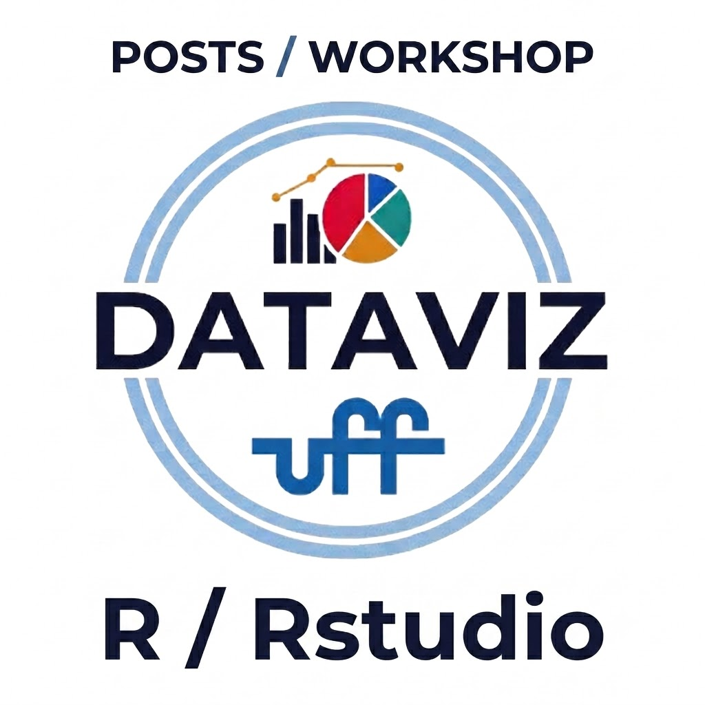
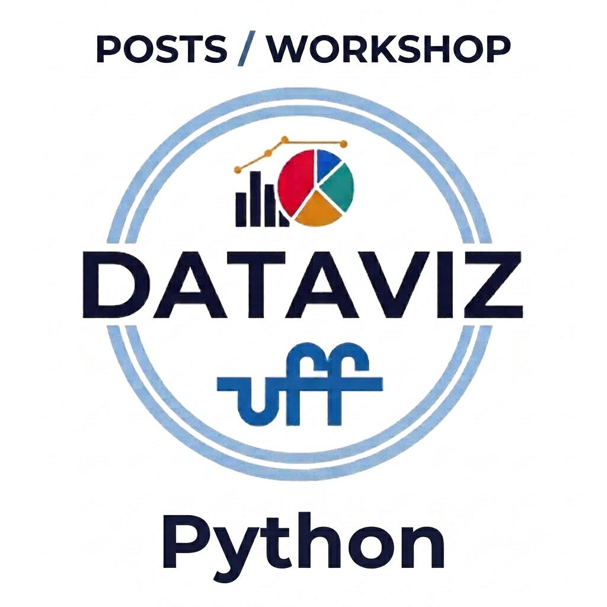

```{r}
#| include: false
# To change the hero-image:

# open theme.css
# find the .hero-image section
```

```{r}
#| include: false
library(htmltools)
source("R/functions.R")
```

:::{.column-screen}
:::{.column-body}


# DataViz

::: {style="text-align: justify;"}
O projeto DataViz UFF é uma iniciativa que promove o ensino e a disseminação de conhecimentos sobre visualização de dados, com o objetivo de capacitar estudantes a interpretar e comunicar informações de forma clara e visualmente impactante. Todas as disciplinas oferecidas pelo [Departamento de Estatística](https://estatistica.uff.br) com carga horária prática envolvem também análise de informações que necessitam de visualização adequada. Nesse sentido, o DataViz UFF visa fortalecer a instrumentalização em visualização de dados na linguagem R, integrando práticas pedagógicas e tecnológicas para transformar dados complexos em representações gráficas compreensíveis.
:::

<br>

:::
:::

***


:::{.column-screen}
:::{.column-screen-inset}
:::{.home-column-image .col-right}
<a href="https://estatistica.uff.br">
{.home-img-lens}
</a>

:::

:::{.home-column-text .col-left}

<center> 

<a href="https://estatistica.uff.br">
<h1 class="heading-home">Data </img> Viz</h1>
</a>

<span> Projeto de Monitoria da [Estatística](https://estatistica.uff.br) voltada para a matéria de Visualização de Dados(Get-00234) com o objetivo de mostra a funcionalidade da ferramenta Quarto para website, utilizando R.</span><br>

Feito por [Guilherme Veloso](http://lattes.cnpq.br/7520289716113534) Orientador e [Leonardo Vinicius](https://www.linkedin.com/in/leonardo-vinicius-dos-santos-ramos/) Aluno do [Curso de Graduação em Estatística](https://estatistica.uff.br){style="font-face:italic;"}<br>

<span style="font-size:.7rem; color:#a7abb4;">Imagens usadas são totalmente autorais do Departamento de Estatística da UFF</span>

</center>

:::
:::

:::

***

:::{.column-screen style="background-color:#04807c;"}
:::{.column-screen-inset}
:::{.home-column-image .col-left}

<a href="posts/index.qmd">

{.home-img}

</a>

:::

:::{.home-column-text .col-right}

<center> <h1 class="heading-home" style="color: #fff;">Posts/workshops</h1>
<span style = "color: #fff; font-style: italic">Posts, Workshops e Publicações voltadas a visualização de dados no R</span> 
</center>


```{r, echo = FALSE}
tags$div(class = "category-row",
         
  tags$div( 
    class = "category-column",
    tags$a(href = "posts/index.html#category=Gráficos",
      tags$img(
        href = "posts/index.html#category=Gráficos",
        src = "Imagens/stats.svg",
        style = "color:#fff !important;",
        class = "category-image honey-white"
  )),
  tags$h4(style = "text-align:center;",
      tags$a(
        class = "white",
        href = "posts/index.html#category=Summaries", "Gráficos"))),
  
  tags$div( 
    class = "category-column",
    tags$a(href = "posts/index.html#category=Mapas",
      tags$img(
        href = "posts/index.html#category=Mapas",
        src = "Imagens/brazil.svg",
        style = "color:#fff !important;",
        class = "category-image honey-white"
  )),
  tags$h4(style = "text-align:center",
      tags$a(
        class = "white",
        href = "posts/index.html#category=Maps", "Mapas"))),
  
  tags$div( 
    class = "category-column",
    tags$a(href = "posts/index.html#category:Manipulation",
      tags$img(
        href = "posts/index.html#category=Manipulation",
        src = "Imagens/database-management.svg",
        style = "color:#fff !important;",
        class = "category-image honey-white"
  )),
  tags$h4(style = "text-align:center",
      tags$a(
        class = "white",
        href = "posts/index.html#category=Trees", "Manipulação")))
  
  )
```


:::
:::

:::

***

:::{.column-screen style="background-color:#4a8fc1;"}
:::{.column-screen-inset}
:::{.home-column-image .col-right}

<a href="posts/index.qmd">

{.home-img}

</a>

:::

:::{.home-column-text .col-left}

<center> <h1 class="heading-home" style="color: #fff;">Posts/workshops</h1>
<span style = "color: #fff; font-style: italic">Posts, Workshops e Publicações voltadas a visualização de dados no Python</span> 
</center>


```{r, echo = FALSE}
tags$div(class = "category-row",
         
  tags$div( 
    class = "category-column",
    tags$a(href = "posts/index.html#category=Gráficos",
      tags$img(
        href = "posts/index.html#category=Gráficos",
        src = "Imagens/stats.svg",
        style = "color:#fff !important;",
        class = "category-image honey-white"
  )),
  tags$h4(style = "text-align:center;",
      tags$a(
        class = "white",
        href = "posts/index.html#category=Summaries", "Gráficos"))),
  
  tags$div( 
    class = "category-column",
    tags$a(href = "posts/index.html#category=Mapas",
      tags$img(
        href = "posts/index.html#category=Mapas",
        src = "Imagens/brazil.svg",
        style = "color:#fff !important;",
        class = "category-image honey-white"
  )),
  tags$h4(style = "text-align:center",
      tags$a(
        class = "white",
        href = "posts/index.html#category=Maps", "Mapas"))),
  
  tags$div( 
    class = "category-column",
    tags$a(href = "posts/index.html#category:Manipulation",
      tags$img(
        href = "posts/index.html#category=Manipulation",
        src = "Imagens/database-management.svg",
        style = "color:#fff !important;",
        class = "category-image honey-white"
  )),
  tags$h4(style = "text-align:center",
      tags$a(
        class = "white",
        href = "posts/index.html#category=Trees", "Manipulação")))
  
  )
```
:::
:::
:::
***


