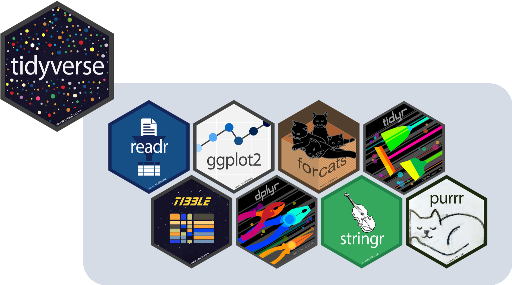

<style>
.sidebar-footer {
  position: fixed;
  bottom: 10px;
  left: 10px;
  font-size: 0.9em;
  color: #555;
}
</style>

<div class="sidebar-footer">
  <strong>Orientador:</strong> Rafael Erbisti
</div>

<style>
/* Container principal - centraliza tudo */
.title-container {
  text-align: center;
  margin: 0 auto 30px auto;
  width: 100%;
  max-width: 900px;
}

/* Título */
h1.title {
  color: #2c3e50;
  text-align: center !important;
  margin-bottom: 10px !important;
  padding-bottom: 10px;
  border-bottom: 2px solid #3498db;
}

/* Autor */
.author {
  display: block;
  text-align: center !important;
  font-style: italic;
  color: #7f8c8d;
  margin-bottom: 5px !important;
}

/* Data */
.date {
  display: block;
  text-align: center !important;
}
</style>


```{r knitr_init, echo=FALSE, cache=FALSE, warning=FALSE, include = FALSE}
library(knitr)
library(rmdformats)
library(tidyverse)
 
 ## Global options
options(max.print="75")
opts_chunk$set(cache=TRUE,
                prompt=FALSE,
                tidy=TRUE,
                comment=NA,
                message=FALSE,
                warning=FALSE)
opts_knit$set(width=75)


```

## Introdução 


```{r fig.align='center', out.width='60%', echo=FALSE}

```


O ```Tidyverse``` é um conjunto de pacotes do R com as ferramentas necessárias para realizar uma análise de dados.

### Instalando e carregando o tidyverse
```{r instalando tidyverse}
# Instalar o 'tidyverse' caso esteja faltando
if (!require("tidyverse")) install.packages("tidyverse")
# Carregando o pacote
library(tidyverse)

```

Dentro do tidyverse, seguintes pacotes estão inclusos:

- ```tibble``` para data frames;

- ```readr``` para importação de bases;

- ```tidyr``` e ```dplyr``` para manipulação de dados;

- ```stringr``` para trabalhar com textos;

- ```forcats``` para trabalhar com fatores;

- ```ggplot2``` para construção de gráficos;

- ```purrr``` para programação funcional;

- ```lubridate``` para trabalhar com datas.


### O pipe (%>%)

O operador pipe (%>%) do pacote ```magrittr``` é uma estrutura essencial para melhorar a legibilidade dos códigos. Ele usa o valor resultante da expressão do lado esquerdo como primeiro argumento da função do lado direito.

Vamos comparar as operações *com* e *sem* o uso do pipe.

Calculemos a média com 2 casas decimais de um vetor ```a```. Considere que o vetor possui 1000 valores de uma Normal(0,1)

```{r pipe}
a = rnorm(1000,0,1)

# Sem pipe
round(mean(a),2)

#Com pipe
a %>% 
  mean() %>% 
  round(2)
```
É possível perceber o passo-a-passo do código no segundo exemplo.


Na versão 4.1 do **R** foi implementada o ```|>``` , versão nativa do pipe. 
Para agilizar a codificação, é possível usar o pipe com o atalho **Ctrl + Shift + m**.

## Leitura da base de dados

### Caminhos

Antes de utilizar as funções de importação dos dados, é importante saber qual é o caminho do arquivo.

O diretório de trabalho (working directory) é a pasta em que o R vai procurar arquivos.

É possível mudar o diretório utilizando a função ```setwd()``` com o caminho do arquivo ou em Session > Set Working Directory.


### O pacote ```readr``` 

```{r fig.align='center', out.width='30%', echo=FALSE}

```


O readr do tidyverse é utilizado para importar arquivos de texto. Para carregá-lo, basta compilar o código: 

```{r readr}
library(readr)
```

O readr transforma arquivos de textos em tibbles usando as seguintes funções:

- read_csv(): para arquivos separados por vírgula.

- read_csv2(): para arquivos separados por ponto e vírgula (comum em países que usam a “,” como separador decimal).

- read_tsv(): para arquivos separados por tabulação.

- read_delim(): para arquivos separados por um delimitador genérico. O argumento delim= indica qual caractere separa cada coluna no arquivo de texto.

- read_table(): para arquivos de texto tabular com colunas separadas por espaço.

Os principais argumentos dessas funções são:

- **file**: nome do arquivo a ser importado

- **locale**: controla tipo de separador decimal, enconding de caracteres, formato de datas, etc

- **na**: define o caracter a ser usado para dado faltante


Tente ler as seguintes bases de dados:

```{r}
performance = read_delim('bases/CleanedStudentsPerformance.txt')
```

```{r lendo student_habits_performance.csv}
dengue2023 = read_csv('bases/DENGBR23.csv')

```


### O pacote readxl


```{r fig.align='center', out.width='30%', echo=FALSE}

```

Para ler planilhas do Excel, podemos utilizar as funções read_xlsx, read_xls ou read_excel(ela consegue detectar a extensão do arquivo).

```{r instalar_readxl, warning=FALSE}
#instale o pacote caso necessário
if (!require("readxl")) install.packages("readxl")
library(readxl)

#Leitura da base
covid = read_xlsx('bases/covid.xlsx')

```


## Manipulação da base de dados

Nesta introdução à manipulação de dados, serão utilizadas bases simples dos pacotes do R a fim de melhorar a visualização das mudanças após o uso das funções.

Serão utilizadas as seguintes bases:

```{r pacote dados}
library(dados)
#filmes = dados::pixar_filmes
#avaliacao = dados::pixar_avalicao_publico
#population = tidyr::population

```

### O pacote dplyr 

```{r fig.align='center', out.width='30%', echo=FALSE}

```


Principais funções do dplyr:

- select( ): seleciona colunas
- arrange( ): ordena a base
- filter( ): filtra linhas
- mutate( ): cria/modifica colunas
- rename( ): muda o nome da coluna
- group_by( ): agrupa a base
- summarise( ): sumariza a base


Função ```select()```

É possível utilizar a função pela numeração da coluna ou pelo nome da variável

```{r}
#observando a base filmes
#filmes

#Selecionando colunas específicas
#filmes %>% select(filme,3)
```


```{r}
#Selecionando sequência de colunas
#filmes %>% select(2:4)
```


```{r}
# Selecionando apenas colunas que iniciam com a letra 'd'
#filmes%>% select(starts_with('d'))
```


```{r}
# Selecionando todas as colunas retirando as exceções
#filmes %>% select(-c(1,'duracao'))
```

<br>

Função ```arrange()``` 

```{r}
# Ordenando a base pela duração do filmes
#filmes %>% 
#  arrange(duracao)
```

<br>

Função ```filter()```

```{r}
# Selecionando filmes de classificação livre
#filmes %>% filter(classificacao_indicativa == 'Livre')
```


```{r}
# Selecionando filmes que começam com a letra 'T' e possuem menos de 100 minutos de duração

#filmes %>% filter(str_starts(filmes, 'T'),
#                  duracao<100)
```

<br>

Função ```rename()```
```{r}
# Mudando classificacao_indicativa para classificacao
#filmes %>% rename(classificacao = classificacao_indicativa)
```

<br>

Função ```mutate()```

```{r}

#observando a base avaliacao
#avaliacao

# Criando coluna Tomatometro, para avaliar filmes como Podre ou Fresco dependendo da sua nota.

#avaliacao %>% mutate(Tomatometro = case_when(nota_rotten_tomatoes<=60 ~ 'Podre',
#                                              nota_rotten_tomatoes> 60~'Fresco'))

```

<br>

Funções ```group_by()``` e ```summarise()```

```{r}
# Agrupando a base por classificação e sumarizando o número de filmes e a média de duração

#filmes %>% group_by(classificacao_indicativa) %>% 
#  summarize(num_filmes= n(),
#            media_duracao = mean(duracao))
```

<br>

#### Juntando bases de dados

Para juntar duas bases de dados, utilizamos as funções ```inner_join()```, ```left_join()``` , ```right_join()``` e ```full_join()```. As tabelas precisam ter uma ou mais colunas em comum (chaves).

- ```inner_join(x,y)```: retorna todas as linhas de ```x``` onde existem valores correspondentes em ```y``` e todas as colunas de ambas as bases. 

- ```left_join(x,y)```: retorna todas as linhas de ```x``` e todas as colunas de ambas as bases. Linhas de ```y```  sem correspondentes recebem ```NA``` na nova base.

- ```right_join(x,y)```: retorna todas as linhas de ```y``` e todas as colunas de ambas as bases. Linhas de ```x```  sem correspondentes recebem ```NA``` na nova base.

- ```full_join(x,y)```: retorna todas as linhas e colunas de ```x``` e ```y```. Valores sem correspondência receberão ```NA``` na nova base.


Exemplos:

```{r join}
# inner_join
#ijoin = inner_join(avaliacao,filmes,by='filmes')
#ijoin

```

<br>

```{r}
#left_join
#ljoin = left_join(avaliacao,filmes,by='filmes')
#ljoin

```

<br>

```{r}
# right_join
#rjoin = right_join(avaliacao,filmes,by='filmes')
#rjoin
```

<br>

```{r}
#full_join
#fjoin = full_join(avaliacao,filmes,by='filmes')
#fjoin
```

<br>

### O pacote tidyr

```{r fig.align='center', out.width='30%', echo=FALSE}

```

O objetivo do ```tidyr``` é auxiliar o usuário a criar uma base "tidy", onde:

- cada variável é uma coluna;
- cada observação é uma linha;
- cada valor é uma célula.

Principais funções do tidyr:

- pivot_longer( ) e pivot_wider( ): para pivotar a base
- separate( ) e unite( ): para separar ou unir variáveis


Função ```pivot_longer```

Para utilizar, são necessárias as seguintes entradas:

- **data**: base de dados
- **cols**: colunas que serão transpostas
- **names_to**: nome da nova coluna criada a partir das variáveis listadas em cols
- **values_to**: nome da coluna a ser criada com os valores das variáveis

```{r }
# Retirando a coluna nota_cinema_score (pois a nota está em caractere) e alongando o restante das informações

#avaliacao %>% select(-nota_cinema_score) %>% 
#  pivot_longer(cols = "nota_rotten_tomatoes":"nota_critics_choice",
#                           names_to = "critério",
#                           values_to = "nota")


```

Função ```pivot_wider( )```

Os principais argumentos da função pivot_wider() são:

- **data**: base de dados
- **names_from**: coluna cujos valores serão usados como nomes de colunas
- **values_from**: coluna cujos valores serão usados como valores das células


```{r pivot_wider}
# Vendo a base original
#population

#population %>%
#  pivot_wider(
#    names_from = year,
#    values_from = population
#  )

```

Função ```separate( )```

Entradas:

- **data**: base de dados
- **col**: nome da coluna que deseja separar
- **into**: nome das novas colunas
- **sep**: separador

```{r}
# Separando a coluna data_lancamento em 3 colunas (ano, mês e dia)
#filmes %>% separate(
#  col = data_lancamento,
#  into = c('ano','mes','dia'),
#  sep = '-'
#)

```


Função ```unite( )```

- **data**: base de dados
- **col**: nome da coluna nova unificada
- **sep**: separador


```{r}
# criando coluna panorama_notas separando cada informação das ex-colunas de nota com '/'
#avaliacao %>% unite(
#  col = 'panorama_notas',
#  nota_rotten_tomatoes,
#  nota_metacritic,
#  nota_cinema_score,
#  nota_critics_choice,
#  sep = '/'
#)

```


