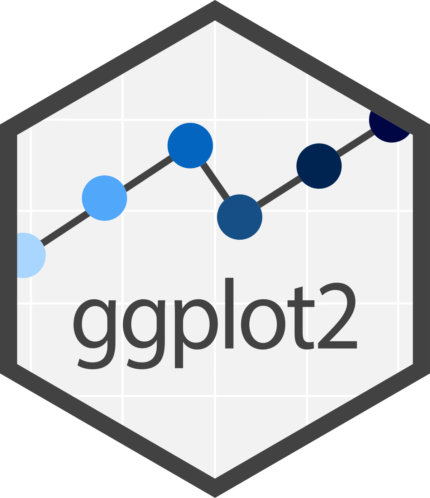

<style>
.sidebar-footer {
  position: fixed;
  bottom: 10px;
  left: 10px;
  font-size: 0.9em;
  color: #555;
}
</style>

<div class="sidebar-footer">
  <strong>Orientador:</strong> Rafael Erbisti
</div>

<style>
/* Container principal - centraliza tudo */
.title-container {
  text-align: center;
  margin: 0 auto 30px auto;
  width: 100%;
  max-width: 900px;
}

/* Título */
h1.title {
  color: #2c3e50;
  text-align: center !important;
  margin-bottom: 10px !important;
  padding-bottom: 10px;
  border-bottom: 2px solid #3498db;
}

/* Autor */
.author {
  display: block;
  text-align: center !important;
  font-style: italic;
  color: #7f8c8d;
  margin-bottom: 5px !important;
}

/* Data */
.date {
  display: block;
  text-align: center !important;
}
</style>


```{r knitr_init, echo=FALSE, cache=FALSE, warning=FALSE, include = FALSE}
library(knitr)
library(rmdformats)
library(tidyverse)
 
 ## Global options
options(max.print="75")
opts_chunk$set(cache=TRUE,
                prompt=FALSE,
                tidy=TRUE,
                comment=NA,
                message=FALSE,
                warning=FALSE)
opts_knit$set(width=75)


```

# **Introdução ao ggplot2**

```{r fig.align='center', out.width='30%', echo=FALSE}

```

O ```ggplot2``` é um pacote estruturado de forma que seja possível criar gráficos elaborados a partir de múltiplas camadas. Os componentes básicos são os mesmos para todos os gráficos: um conjunto de dados, sistema de coordenadas e os objetos geométricos denominados ```geoms```. 

Para construir os gráficos, é utilizada a função ```ggplot( )```. Após definir seus argumentos principais, outras funções são usadas em cadeia (formando camadas) , com o sinal *+*, para customizar o painel da  maneira que o usuário preferir.


# **Gráfico de pontos**

## **Definindo os principais elementos**

A base utilizada para exemplificar as funções será a do arquivo ```student_habits_performance.csv```.

```{r lendo a base}
# Instalando e carregando o pacote
if(!require("ggplot2")) install.packages("ggplot2")
library(ggplot2)

#Leitura da base de dados 
library(tidyverse)
performance = read_csv('base/student_habits_performance.csv')
#Retirando o gênero "Other"
performance = performance %>% filter(gender!='Other')

performance
```

<br>

O primeiro argumento da função ```ggplot( )``` é o *data*, o data.frame com os dados. Em seguida, precisamos mapear as propriedades visuais do gráfico com o *mapping*, utilizando o *aes*. No argumento *aes*, devem ser especificadas as variáveis dos eixos *x* e *y*, *cores* e *símbolos* para plotar os dados.

```{r}

performance %>% ggplot(mapping = aes(x = study_hours_per_day, y = exam_score)) 

```

Percebam que o gráfico está vazio. Precisamos adicionar a camada com o elemento ```geom_```.
Neste caso, como queremos um gráfico de dispersão, vamos utilizar o ```geom_point( )```

```{r}
performance %>% 
  ggplot(aes(x = study_hours_per_day, y = exam_score)) +
  geom_point()
```

Pode-se definir outras especificações em uma função ```geom_```.
No gráfico abaixo, foram modificados o tamanho, o formato, a cor e a transparência (que varia de 0 a 1) dos pontos. 

```{r}
performance %>% 
  ggplot(aes(x = study_hours_per_day, y = exam_score)) +
  geom_point(size = 1,color = 'blue', shape = 24, alpha = 0.8)
```

É possível também, adicionar outros elementos geométricos no mesmo gráfico.
Neste exemplo, foi adicionada uma reta de regressão linear pela função ```geom_smooth```


```{r}
performance %>% 
  ggplot(aes(x = study_hours_per_day, y = exam_score)) +
  geom_point() +
  geom_smooth(method='lm', # o método utilizado é o linear model
              se = F, # retirando o se (erro padrão)
              linewidth=2, # alterando a grossura da linha
              color='red') 

```

## **Agrupamentos**

Além de mapear as variáveis que devem aparecer nos eixos, também se pode usar variáveis para mapear cores, forma, tamanho, transparência e outras características visuais dos objetos geométricos no gráfico. Isso permite sobrepor grupos de observações em um mesmo gráfico.

```{r}
# Mapando as cores dos pontos de acordo com o gênero
performance %>% 
  ggplot(aes(x = study_hours_per_day, y = exam_score, color = gender)) + 
  geom_point()+
  geom_smooth(method='lm',se = F)
```

## **Escalas**

o ```ggplot2``` fornece escalas automáticas aos gráficos. No entanto, o controle sobre essas escalas é necessário para uma melhor visualização.

As funções utilizadas para controlar as escalas dos elementos de um gráfico do ggplot2 seguem um padrão. Todas possuem nomes iniciados com ```scale_```, depois o nome do elemento estético (color, fill, x etc.) e, por fim, o tipo/nome da escala que será aplicada.

As especificações do ```scale_x_continuous``` e do ```scale_y_continuous``` incluem o breaks e label.

```{r cores específicas}
performance %>% 
  ggplot(aes(x = study_hours_per_day, y = exam_score, color = gender)) +
  geom_point()+
  geom_smooth(method='lm',se = F)+
  scale_y_continuous(breaks = seq(0, 100, 20))+ # sequência de 0 a 100 a cada 20 unidades
  scale_x_continuous(breaks = seq(0,max(performance$study_hours_per_day,1)))+ #sequência de 0 ao máximo de horas de estudo a cada 1 unidade
  scale_color_manual(values = c("Red","Blue"), #atribuindo cores vermelho e azul
                     labels = c("Mulher","Homem")) #mudando o texto das categorias
```

## **Rótulos**

A função ```labs``` fornece rótulos personalizados para os eixos e legendas. Além disso, podem ser adicionados um título, subtítulo e legenda.

```{r labs}
performance %>% 
  ggplot(aes(x = study_hours_per_day, y = exam_score, color = gender)) +
  geom_point()+
  geom_smooth(method='lm',se = F)+
  scale_y_continuous(breaks = seq(0, 100, 20))+
  scale_x_continuous(breaks = seq(0,max(performance$study_hours_per_day,1)))+
  scale_color_manual(values = c("Red","Blue"),
                     labels = c("Mulher","Homem")) + 
  labs(x = "Horas de Estudo Diário", 
       y = "Nota" ,
       color = "" , # foi deixado vazio dentro das aspas para tirar o o título da legenda
       title = "Relação entre Horas de Estudo e Nota",
       subtitle = "Student Habits vs Academic Performance: A Simulated Study",
       caption = "Fonte: https://www.kaggle.com/datasets") 

```


## **Temas**

É possível alterar a aparência do gráfico manualmente usando o ```theme( )``` ou utilizando temas prontos com funções ```theme_```.

No link ```https://ggplot2.tidyverse.org/reference/ggtheme.html``` são apresentados os tipos de temas prontos do pacote.


```{r temas prontos}
# Usando o theme_classic( )
performance %>% 
  ggplot(aes(x = study_hours_per_day, y = exam_score, color = gender)) +
  geom_point()+
  geom_smooth(method='lm',se = F)+
  scale_y_continuous(breaks = seq(0, 100, 20))+
  scale_x_continuous(breaks = seq(0,max(performance$study_hours_per_day,1)))+
  scale_color_manual(values = c("Red","Blue"),
                     labels = c("Mulher","Homem"))+ # mudando o nome das categorias
  labs(x = "Horas de Estudo Diário", y = "Nota" ,color = "" ,
       title = "Relação entre Horas de Estudo e Nota",
       subtitle = "Student Habits vs Academic Performance: A Simulated Study",
       caption = "Fonte: https://www.kaggle.com/datasets") +
  theme_classic()
```

```{r}
#Modificando o tema manualmente
performance %>% 
  ggplot(aes(x = study_hours_per_day, y = exam_score, color = gender)) +
  geom_point()+
  geom_smooth(method='lm',se = F)+
  scale_y_continuous(breaks = seq(0, 100, 20))+
  scale_x_continuous(breaks = seq(0,max(performance$study_hours_per_day,1)))+
  scale_color_manual(values = c("Red","Blue"),
                     labels = c("Mulher","Homem"))+ # mudando o nome das categorias
  labs(x = "Horas de Estudo Diário", 
       y = "Nota" ,
       color = "" , # tirando o rótulo 
       title = "Relação entre Horas de Estudo e Nota",
       subtitle = "Student Habits vs Academic Performance: A Simulated Study",
       caption = "Fonte: https://www.kaggle.com/datasets") +
  theme(axis.title = element_text(size = 13, face = 'bold',color = "gray19"), # colocando o título dos eixos em negrito e mudando a cor
        axis.title.x = element_text(margin = margin(t = 13)), # aumentando a margem entre o rótulo do eixo x e o gráfico
        axis.title.y = element_text(margin = margin(r = 13)), # aumentando a margem entre o rótulo do eixo y e o gráfico
        plot.title = element_text(face = 'bold'), # deixando o título do gráfico em negrito
        panel.grid = element_blank(), # retirando a borda do gráfico
        panel.background = element_rect(fill = 'lightpink')) # mudando a cor do fundo 
```

As cores podem ser definidas pelo nome padrão do R ou em código hexadecimal.

Cores padrão do R -> ```http://www.stat.columbia.edu/~tzheng/files/Rcolor.pdf```

Cores em código hexadecimal -> Gerador de cores aleatórias ```https://coolors.co/```


## **Facetas**

Os ```facets``` reproduzem um gráfico para cada nível de uma determinada variável (ou combinação de variáveis). Os ```facets``` são criados usando funções que começam com ```facet_```. Quando deseja-se criar gráficos para todas as categorias de uma variável categórica, pode-se usar o ```facet_wrap```. 

```{r face_wrap}
performance %>% 
  ggplot(aes(x = study_hours_per_day, y = exam_score, color = gender)) +
  geom_point()+
  geom_smooth(method='lm',se = F)+
  scale_y_continuous(breaks = seq(0, 100, 20))+
  scale_x_continuous(breaks = seq(0,max(performance$study_hours_per_day,1)))+
  scale_color_manual(values = c("Red","Blue"),
                     labels = c("Mulher","Homem"))+ 
  facet_wrap(~internet_quality)+ # reprodução do gráfico para categorias da variável qualidade de internet
  labs(x = "Horas de Estudo Diário", y = "Nota" ,color = "" ,
       title = "Relação entre Horas de Estudo e Nota",
       subtitle = "Student Habits vs Academic Performance: A Simulated Study",
       caption = "Fonte: https://www.kaggle.com/datasets") +
  theme(axis.title = element_text(size = 13, face = 'bold',color = "gray19"), 
        axis.title.x = element_text(margin = margin(t = 13)), 
        axis.title.y = element_text(margin = margin(r = 13)), 
        plot.title = element_text(face = 'bold'),
        panel.grid = element_blank(),
        panel.background = element_rect(fill = 'gray90'))
```

Quando o interesse for em reproduzir os gráficos para os níveis de duas variáveis categóricas, a função ```facet_grid( )``` é utilizada.

```{r facet_grid}
performance %>% 
  ggplot(aes(x = study_hours_per_day, y = exam_score, color = gender)) +
  geom_point()+
  geom_smooth(method='lm',se = F)+
  scale_y_continuous(breaks = seq(0, 100, 20))+
  scale_x_continuous(breaks = seq(0,max(performance$study_hours_per_day,1)))+
  scale_color_manual(values = c("Red","Blue"),
                     labels = c("Mulher","Homem"))+ 
  facet_grid(part_time_job~internet_quality)+ # reprodução do gráfico para qualidade da internet e trabalho
  labs(x = "Horas de Estudo Diário", y = "Nota" ,color = "" ,
       title = "Relação entre Horas de Estudo e Nota",
       subtitle = "Student Habits vs Academic Performance: A Simulated Study",
       caption = "Fonte: https://www.kaggle.com/datasets") +
  theme(axis.title = element_text(size = 13, face = 'bold',color = "gray19"), 
        axis.title.x = element_text(margin = margin(t = 13)), 
        axis.title.y = element_text(margin = margin(r = 13)), 
        plot.title = element_text(face = 'bold'),
        panel.grid = element_blank(),
        panel.background = element_rect(fill = 'gray90'))
```

É possível alterar o texto das categorias dos ```facets``` com o argumento ```labeller``` ou modificando direto na base.

```{r}
# base modificada 
perf_final = performance%>% mutate(internet_quality = factor(internet_quality,
                                      levels = c('Poor','Average','Good'),
                                      labels = c('Baixa','Média','Alta')))

# vetor com novos rótulos
job = c('Yes'='Sim','No'='Não')

perf_final %>% 
  ggplot(aes(x = study_hours_per_day, y = exam_score, color = gender)) +
  geom_point()+
  geom_smooth(method='lm',se = F)+
  scale_y_continuous(breaks = seq(0, 100, 20))+
  scale_x_continuous(breaks = seq(0,max(performance$study_hours_per_day,1)))+
  scale_color_manual(values = c("Red","Blue"),
                     labels = c("Mulher","Homem"))+ # mudando o nome das categorias
  facet_grid(part_time_job~internet_quality,
             labeller = labeller(part_time_job = job))+ # reprodução do gráfico para qualidade da internet e trabalho e mudanças nos textos das categorias
  labs(x = "Horas de Estudo Diário", y = "Nota" ,color = "" ,
       title = "Relação entre Horas de Estudo e Nota",
       subtitle = "Student Habits vs Academic Performance: A Simulated Study",
       caption = "Fonte: https://www.kaggle.com/datasets\n\nNota: As facetas representam:\n- Linhas: Trabalho de meio período (Sim/Não)\n- Colunas: Qualidade da Internet (Baixa/Média/Alta)") +
  theme(axis.title = element_text(size = 13, face = 'bold',color = "gray19"), 
        axis.title.x = element_text(margin = margin(t = 13)), 
        axis.title.y = element_text(margin = margin(r = 13)), 
        plot.title = element_text(face = 'bold'),
        panel.grid = element_blank(),
        panel.background = element_rect(fill = 'gray90'), 
        strip.background = element_rect(fill='white',color='gray19'), 
        strip.text = element_text(face='bold'), # deixando o texto das categorias em negrito
        legend.position = 'bottom') # alterando a posição da legenda
```

## **Gráfico de médias com intervalos de erro**

O gráfico de médias com intervalos de erro é um método popular para comparar grupos com relação a uma variável numérica . A barra de erro pode representar um desvio padrão, um erro padrão da média ou um intervalo de confiança.

```{r}

media_perf = performance %>% 
  group_by(gender) %>% 
  summarise(n = n(),
            media = mean(exam_score, na.rm=TRUE),
            dp = sd(exam_score, na.rm = TRUE),
            errop = dp/sqrt(n))

media_perf %>% 
  ggplot(aes(x = gender,y = media))+
  geom_point(size =3)+
  geom_errorbar(aes(ymin = media - 2*errop, # definindo o limite mínimo do eixo y
                    ymax = media + 2*errop),# definindo o limite máximo do eixo y
                width=0.2) # definindo o tamanho do traço
  
```

Podemos comparar a média entre mais grupos.


```{r}
media_perf = performance %>% 
  group_by(gender,diet_quality) %>% 
  summarise(n = n(),
            media = mean(exam_score, na.rm=TRUE),
            dp = sd(exam_score, na.rm = TRUE),
            errop = dp/sqrt(n))

media_perf %>% 
  ggplot(aes(x = gender, y = media, color=diet_quality))+
  geom_point(size =3,
             position = position_dodge(width = 0.5))+ # argumento para evitar sobreposição dos pontos
  geom_errorbar(aes(ymin = media - 2*errop, 
                    ymax = media + 2*errop),
                width=0.2,
                position = position_dodge(width = 0.5)) + # argumento para evitar sobreposição das barras
  scale_color_discrete(labels = c('Média','Boa','Ruim'))+ # mmudando o texto das categorias
  labs(x = 'Gênero', y = 'Nota', color = 'Qualidade da dieta')
```

# **Gráfico de barras**

Outra base utilizada será a do arquivo ```DENGBR23.csv```

```{r}
# Lendo os dados
dengue2023 = read_csv('base/DENGBR23.csv') 

# Selecionando as colunas de interesse e modificando as categorias
dados = dengue2023 %>% select(3:ID_OCUPA_N) %>% 
  mutate(DT_NOTIFIC = as.Date(DT_NOTIFIC),
         REGIAO = case_when(
           SG_UF %in% c(11, 12, 13, 14, 15, 16, 17) ~ "Norte",
           SG_UF %in% c(21, 22, 23, 24, 25, 26, 27, 28, 29) ~ "Nordeste",
           SG_UF %in% c(50, 51, 52, 53) ~ "Centro-Oeste",
           SG_UF %in% c(31, 32, 33, 35) ~ "Sudeste",
           SG_UF %in% c(41, 42, 43) ~ "Sul"),
         CS_RACA = factor(CS_RACA, 
                          levels =c(1,2,3,4,5,9),
                          labels = c('Branca','Preta','Amarela','Parda',
                                     'Indígena','Ignorado')))

dados
```


O gráfico de barras ou colunas é utilizado para fazer comparações entre as categorias de uma variável qualitativa. 

No gráfico abaixo, é apresentando um gráfico de barras de frequência de casos de dengue por raça.

```{r}
dados %>% 
  filter(!CS_RACA == 'Ignorado',
         !is.na(CS_RACA)) %>% 
  ggplot(aes(x = CS_RACA))+
  geom_bar() # por default, o geom_bar() adota o stat = 'count' 
```

Outra forma de fazer o mesmo gráfico, é criando um ```tibble``` com uma coluna adicional com as frequências e utilizando-a para a construção do gráfico.

```{r}
# criando a tabela

casos_raca = dados %>% 
  group_by(CS_RACA) %>% 
  summarize(n = n())

casos_raca

# plotando

casos_raca %>%   
  filter(!CS_RACA == 'Ignorado',
                        !is.na(CS_RACA)) %>% 
  ggplot(aes(x = CS_RACA,y = n))+
  geom_bar(stat='identity') # o 'identity' serve para indicar à função que as barras deverão ser plotadas de acordo com os valores do y

```

As barras podem ser customizadas dentro da função ```geom_bar``` com o ```fill``` e ```color```. Esses argumentos controlam as cores do preenchimento e do contorno da barra, respectivamente. Também usa-se o labs para tratar os rótulos do gráfico.

```{r}
casos_raca %>% 
  filter(!CS_RACA == 'Ignorado',
         !is.na(CS_RACA)) %>% 
  ggplot(aes(x = CS_RACA,y = n))+
  geom_bar(stat = 'identity',
           fill = 'cornflowerblue', # mudando a cor de preenchimento
           color='black')+ # mudando a cor do contorno
  scale_y_continuous(labels = scales::number_format(big.mark = '.',decimal.mark = ','))+ # tirando a notação científica 
  labs(x = 'Raça', y = 'Frequência') # alterando os rótulos
```

As formas comuns de apresentar as barras, são em ordem crescente e decrescente.

```{r}
# ordenando as barras

##crescente
casos_raca %>% 
  filter(!CS_RACA == 'Ignorado',
         !is.na(CS_RACA))%>% 
  ggplot(aes(x = reorder(CS_RACA,n),y = n))+ # reordenando de acordo com o valor de n (frequência)
  geom_bar(stat = 'identity',fill = 'cornflowerblue',color='black')+
  scale_y_continuous(labels = scales::number_format(big.mark = '.',decimal.mark = ','))+
  labs(x = 'Raça', y = 'Frequência')

##decrescente
casos_raca %>% 
  filter(!CS_RACA == 'Ignorado',
         !is.na(CS_RACA)) %>% 
  ggplot(aes(x = reorder(CS_RACA,-n),y = n))+ # reordenando de acordo com o valor de -n
  geom_bar(stat = 'identity',fill = 'cornflowerblue',color='black')+
  scale_y_continuous(labels = scales::number_format(big.mark = '.',decimal.mark = ','))+
  labs(x = 'Raça', y = 'Frequência')
```


Para incluir os valores observados nas barras, usa-se o ```geom_text```, que é utilizado para incluir uma camada de texto. No mapeamento do ``` geom_text``` foram incluídos como rótulos os valores ```n``` e o ```vjust``` para controlar o alinhamento vertical (hjust controla o alinha horizontal).

```{r}
casos_raca %>% 
  filter(!CS_RACA == 'Ignorado',
         !is.na(CS_RACA))%>% 
  ggplot(aes(x = reorder(CS_RACA,n),y = n))+
  geom_bar(stat = 'identity',fill = 'cornflowerblue',color='black')+
  geom_text(aes(label=n),vjust = -0.5)+
  scale_y_continuous(labels = scales::number_format(big.mark = '.',decimal.mark = ','))+
  labs(x = 'Raça', y = 'Frequência')
  
```

Dependendo do tamanho dos rótulos dos eixos, é necessário fazer modificações nos textos para facilitar a visualização dos gráficos. Existem algumas formas para evitar a sobreposição dos rótulos:

- Alterando a angulação dos rótulos com ```axis.text.x``` dentro da função ```theme( )```
 
```{r}
casos_raca %>% 
  filter(!CS_RACA == 'Ignorado',
         !is.na(CS_RACA))%>% 
  ggplot(aes(x = reorder(CS_RACA,n),y = n))+
  geom_bar(stat = 'identity',fill = 'cornflowerblue',color='black')+
  geom_text(aes(label=n),vjust = -0.5)+
  scale_y_continuous(labels = scales::number_format(big.mark = '.',decimal.mark = ','))+
  labs(x = 'Raça', y = 'Frequência')+
  theme(axis.text.x = element_text(angle=45,hjust = 1))
```


- Escalonando os rótulos com o ```scale_x_discrete``` por meio do **guide**

```{r}
casos_raca %>% 
  filter(!CS_RACA == 'Ignorado',
         !is.na(CS_RACA))%>% 
  ggplot(aes(x = reorder(CS_RACA,n),y = n))+
  geom_bar(stat = 'identity',fill = 'cornflowerblue',color='black')+
  geom_text(aes(label=n),vjust = -0.5)+
  scale_y_continuous(labels = scales::number_format(big.mark = '.',decimal.mark = ','))+
    labs(x = 'Raça', y = 'Frequência')+
  scale_x_discrete(guide=guide_axis(n.dodge=2))
```


- Invertendo o gráfico com o ```coord_flip()```


```{r out.width="90%", out.height="70%"}
casos_raca %>% 
  filter(!CS_RACA == 'Ignorado',
         !is.na(CS_RACA))%>% 
  ggplot(aes(x = reorder(CS_RACA,n),y = n))+
  geom_bar(stat = 'identity',fill = 'cornflowerblue',color='black')+
  geom_text(aes(label=n),
            hjust=-0.5, # como as coordenadas foram invertidas, o hjust é modificado
            size=3)+ 
  scale_y_continuous(labels = scales::number_format(big.mark = '.',decimal.mark = ','))+
  labs(x = 'Raça', y = 'Frequência')+
  coord_flip()

```


### **Gráfico Barras agrupadas**

O gráfico de barras agrupadas ajuda a avaliar a relação entre duas variáveis qualitativas. 

O mapeamento do gráfico abaixo é definida pela raça (eixo x) e pelo sexo do indivíduo (fill). Desta forma, são construídas barras para cada raça com cores separadas de acordo com o sexo.

```{r}
dados %>% 
  filter(!CS_RACA == 'Ignorado',
         !is.na(CS_RACA),
         !CS_SEXO == 'I')%>% 
  ggplot(aes(x = CS_RACA, fill= CS_SEXO ))+
  geom_bar() # por default, o geom_bar agrupado deixam as barras empilhadas (position ='stack')
```

Outra forma de apresentar essas informações é dispondo as barras lado a lado utilizando o argumento ```position ='dodge'``` dentro do ```geom_bar( )```.

```{r lado a lado }
dados %>% 
  filter(!is.na(CS_RACA),
         !CS_SEXO == 'I')%>% 
  ggplot(aes(x = CS_RACA, fill= CS_SEXO ))+
  geom_bar(position='dodge')
```

Para trabalhar com as barras empilhadas na escala de proporção é preciso inserir o argumento ```position = 'fill'``` dentro do ```geom_bar()```.

```{r bar fill}
dados %>% 
  filter(
         !is.na(CS_RACA),
         !CS_SEXO == 'I')%>% 
  ggplot(aes(x = CS_RACA, fill= CS_SEXO ))+
  geom_bar(position='fill')

```

É possível incluir os percentuais no gráfico, utilizando o ```geom_text()```

```{r}
#criando tabela com as contagens e proporções

casos_raca_genero = dados %>% 
  filter(CS_SEXO %in% c('F','M'),
         !is.na(CS_RACA)) %>% 
  group_by(CS_RACA,CS_SEXO) %>% 
  summarise(n = n()) %>% 
  mutate(prop = n/sum(n))

casos_raca_genero %>%  # Calcula posição central da barra
  ggplot(aes(x = CS_RACA, y = prop, fill = CS_SEXO)) + # mudando a ordem 
  geom_bar(stat='identity',position = 'fill') +
  geom_text(aes(label = scales::percent(prop,accuracy = 1)), # colocando a proporção decimal como porcentagem sem casa decimal
            position = position_stack(vjust = 0.5), # definindo a posição do texto
            size=3)+
  scale_y_continuous(breaks = seq(0, 1, 0.2), # definindo as quebras do eixo 
                     label = scales::percent, # definindo a escala em porcentagem
                     expand = expansion(add = c(0, 0.05))) + # grudando as barras no eixo 
  labs(x = 'Raça', y = 'Frequência', fill = 'Sexo') +
  theme_minimal()

```

Para alterar as cores das barras de acordo com as categorias do ```fill```, utilizamos a função ```scale_fill_manual()``` com os argumentos:

- ```breaks``` para definir a ordem as categorias na legenda

- ```labels``` para definir o nome das categorias na legenda

- ```values``` para definir a cor para cada categoria

```{r}
casos_raca_genero %>%  
  ggplot(aes(x = CS_RACA, y = prop, fill = CS_SEXO)) +
  geom_bar(stat='identity',position = 'fill') +
  geom_text(aes(label = scales::percent(prop,accuracy = 1)),
            position = position_stack(vjust = 0.5),
            size=3)+
  scale_y_continuous(breaks = seq(0, 1, 0.2), 
                     label = scales::percent,
                     expand = expansion(add = c(0, 0.05))) +
  scale_fill_manual(breaks = c('F','M'),
                    labels = c('Feminino','Masculino'),
                    values = c('pink','cornflowerblue'))+
  labs(x = 'Raça', y = 'Frequência', fill = 'Sexo') +
  theme_minimal()
```


# **Gráfico de histogramas**

O histograma é uma representação gráfica da distribuição de um conjunto de dados numéricos. Ele é usado para visualizar a frequência com que diferentes intervalos de valores ocorrem em um conjunto de dados.

```{r}
performance %>% 
  ggplot(aes(x = exam_score))+
  geom_histogram() # por default, o geom_histogram() apresenta 30 classes(bins)
```

As modificações de cores são feitas da mesma forma que no gráfico de barras.
Para modificar as classes, podemos utilizar os seguintes argumentos dentro do ```geom_histogram``` 

- ```bins``` para alterar quantidade de classes

- ```binwidth``` para alterar a amplitude de todas as classes

- ```breaks``` para definir intervalos com amplitudes diferentes

```{r}
#bins
performance %>% 
  ggplot(aes(x = exam_score))+
  geom_histogram(fill = "blue",
                 color = "white",
                 bins = 20)+
labs(x = "Nota",
     y = "Frequência")

#binwidth
performance %>% 
  ggplot(aes(x = exam_score))+
  geom_histogram(fill = "blue",
                 color = "white",
                 binwidth = 10)+
labs(x = "Nota",
     y = "Frequência")

#breaks
performance %>% 
  ggplot(aes(x = exam_score))+
  geom_histogram(fill = "blue",
                 color = "white",
                 breaks = c(0,20,50,75,90,100))+
labs(x = "Nota",
     y = "Frequência")

```


# **Boxplot**

O boxplot é uma representação usada para verificar a distribuição de uma variável por meio de seus quantis. Esse gráfico permite verificar os valores de mínimo, máximo e os quartis. Além disso, indica a existência de valores discrepantes (outliers).

```{r boxplot}
performance %>% 
  ggplot(aes(y = exam_score))+
  geom_boxplot()
```

Para adicionar os limites (representados pelos bigodes) no gráfico de boxplot, utilizamos a função ```geom_errorbar```.

```{r}
performance %>% 
  ggplot(aes(y = exam_score))+
  geom_boxplot()+
  geom_errorbar(stat='boxplot', # definição necessária para a função entender quais são os limites 
                width = 0.1) # alterando o tamanho dos bigodes
```


É possível modificar a cor do boxplot usando ```fill``` e ```color``` , modificar outliersm(inclusive removê-los do gráfico) utilizando o argumento ```outlier.shape```.

```{r}
#modificando a forma dos outliers
performance %>% 
  ggplot(aes(y = exam_score))+
  geom_boxplot(fill ='cornflowerblue', 
               color='darkblue',
               outlier.shape = 2)+
  geom_errorbar(stat='boxplot',width = 0.2,color='darkblue')+
  labs(y = 'Nota')

#removendo os outliers
performance %>% 
  ggplot(aes(y = exam_score))+
  geom_boxplot(fill ='cornflowerblue', 
               color='darkblue',
               outlier.shape = NA)+
  geom_errorbar(stat='boxplot',width = 0.2,color='darkblue')+
  labs(y = 'Nota')


```

Assim como nos gráficos anteriores, é possível criar boxplots para cada categoria de uma variável categórica, especificando-a no **mapping**

```{r}
# distribuição da nota de acordo com a variável part_time_job
performance %>% 
  ggplot(aes(x = part_time_job,y = exam_score))+
  geom_boxplot()+
  geom_errorbar(stat='boxplot',
                width=0.1)+
  labs(x = "Trabalho",
       y = "Nota",
       fill='Sexo')

# distribuição da nota de acordo com a variável part_time_job e gender
performance %>% 
  ggplot(aes(x = part_time_job,y = exam_score,fill=gender))+
  geom_boxplot(position = position_dodge(width=0.8), # alterando a proximdade entre as caixas 
               width = 0.5)+ #alterando o tamanho da caixa
  geom_errorbar(stat='boxplot',
                width=0.1,
                position = position_dodge(width=0.8))+ # alterando a posição das barras de erro (utilizar o mesmo argumento position do geom_boxplot para o alinhamento)
  labs(x = "Trabalho",
       y = "Nota",
       fill='Sexo')


```

```{r}
performance %>% 
  ggplot(aes(x = part_time_job,y = exam_score,fill=gender))+
  geom_boxplot(position = position_dodge(width=0.8), 
               width = 0.5)+ 
  geom_errorbar(stat='boxplot',
                width=0.1,
                position = position_dodge(width=0.8))+ 
  scale_fill_manual(breaks = c('Female','Male'),
                    labels = c('Mulher','Homem'),
                    values = c('lightyellow','lightgreen'))+
  scale_x_discrete(labels = c('Não','Sim'))+
  labs(title= 'Distribuição da nota por gênero e trabalho',
       x = "Trabalho",
       y = "Nota",
       fill='Sexo')+
  theme_classic()
```


# **Gráfico de densidade**

Outra forma de representar a ditribuição de uma variável quantitativa, é utilizando gráfico de densidade usando o ```geom_density```

```{r}
performance %>% 
  ggplot(aes(x = exam_score))+
  geom_density()
```

Para comparar distribuições entre as categorias de uma variável qualitativa, precisamos mapear dentro do ```mapping = aes()```.

```{r}
performance %>% 
  ggplot(aes(x = exam_score,fill = gender))+
  geom_density(alpha = 0.4)+ # alterando a opacidade
  scale_fill_discrete(labels = c("Mulher","Homem"))+
  labs(x = 'Nota',
       y = 'Densidade',
       fill = 'Sexo')
```

# **Gráfico de Violino**

Os gráficos de violinos também mostram a distribuição de uma variável quantitativa e é semelhante ao gráfico de densidade, porém ambos argumentos ```x``` e ```y``` são obrigatórios. Sua plotagem é espelhada e rotacionada em 90 graus.

```{r}
#violino
performance %>% 
  ggplot(aes(x = gender,y = exam_score))+
  geom_violin()
```

Podemos combinar boxplots e os violinos.

```{r}
performance %>% 
  ggplot(aes(x = gender,y = exam_score))+
  geom_violin(fill='cornflowerblue')+
  geom_boxplot(fill='darkorange',
               width = 0.5, # alterando o tamanho da caixa para o boxplot ficar dentro do violino
               outlier.shape = NA)+
  scale_x_discrete()+
  labs(x = 'Sexo',
       y = 'Nota')+
  theme_classic()

```


# **Séries Temporais**


```{r}
casos_data = dados %>% group_by(DT_NOTIFIC) %>% 
  summarize(n_casos = n())

casos_data %>% ggplot(aes(x = DT_NOTIFIC,y = n_casos))+
  geom_line()

```


### **Formatando eixos com datas**

Os eixos com as datas são formatadas pelas funções ```scale_x_date``` e ```scale_y_date```. Os principais argumentos dessas funções são:

- ```date_breaks``` para indicar as quebras no eixo

- ```date_labels``` para indicar a formatação dos rótulos

```{r tabela data ,echo=FALSE, cache=FALSE, warning=FALSE}
tabela <- data.frame(
  Código = c("%a", "%A", "%e", "%d", "%m", "%b", "%B", "%y", "%Y"),
  Significado = c("Dia da semana (abreviado)", "Dia da semana (completo)",
                "Dia do mês (sem zero)", "Dia do mês (com zero)",
                "Mês (numérico, com zero)", "Mês (abreviado)",
                "Mês (completo)", "Ano (sem século)", "Ano (com século)"),
  Exemplo = c('"Dom"', '"Domingo"', '"2"', '"02"', '"12"', 
              '"Dez"', '"Dezembro"', '"23"', '"2023"')
)

knitr::kable(tabela, align = "c", format = "pipe",
             caption = "Códigos de formatação de datas em R")
```


```{r }
casos_data %>% ggplot(aes(x = DT_NOTIFIC,y = n_casos))+
  geom_line(col='red', 
            linewidth=1, # alterando a grossura da linha
            linetype = 'dashed')+ # alterando o tipo da linha
  scale_x_date(date_breaks = '3 month',
               date_labels = '%b/%Y')+
  labs(x = 'Data',
       y = 'Casos')+
  theme_classic()
  
```

Para fazer gráfico de linha por categorias de uma variável qualitativa, especificamos a informação no **mapping**

```{r}

casos_data_sexo = dados %>% 
  filter(CS_SEXO %in% c('F','M')) %>% 
  group_by(DT_NOTIFIC, CS_SEXO) %>% 
  summarize(n_casos = n())

casos_data_sexo %>% ggplot(aes(x = DT_NOTIFIC,y = n_casos, color = CS_SEXO))+
  geom_line(linewidth=1)+
  scale_x_date(date_breaks = '3 month',
               date_labels = '%B')+
  labs(x = 'Data',
       y = 'Casos')+
  theme_classic()

```

Supondo que estamos interessados em observar a evolução no número de casos por sexo e região. Podemos reproduzir o gráfico acima para todas as regiões do Brasil usando o ```facet_wrap```.

```{r}
# Agrupando os dados pela data, sexo e região
casos_regiao = dados %>% 
  filter(CS_SEXO %in% c('F','M')) %>% 
  group_by(DT_NOTIFIC, CS_SEXO, REGIAO) %>% 
  summarize(n_casos = n()) 

# plotando
casos_regiao %>% 
  ggplot(aes(x = DT_NOTIFIC, y = n_casos, color = CS_SEXO)) +
  geom_line(linewidth = 1) +
  facet_wrap(~REGIAO) +  
  scale_x_date(
    date_breaks = "3 months",
    date_labels = "%b\n%Y" ) + # o \n é utilizado para quebra de linha
  labs(x = "Data",
       y = "Número de Casos",
       color = "Sexo") +
  theme_classic() +
  theme(axis.text.x = element_text(angle = 45, hjust = 1),  
    legend.position = "bottom")
```

