```{=html}
<style>
.sidebar-footer {
  position: fixed;
  bottom: 10px;
  left: 10px;
  font-size: 0.9em;
  color: #555;
}
</style>
```

::: sidebar-footer
<strong>Orientador:</strong> Rafael Erbisti
:::

```{=html}
<style>
/* Container principal - centraliza tudo */
.title-container {
  text-align: center;
  margin: 0 auto 30px auto;
  width: 100%;
  max-width: 900px;
}

/* Título */
h1.title {
  color: #2c3e50;
  text-align: center !important;
  margin-bottom: 10px !important;
  padding-bottom: 10px;
  border-bottom: 2px solid #3498db;
}

/* Autor */
.author {
  display: block;
  text-align: center !important;
  font-style: italic;
  color: #7f8c8d;
  margin-bottom: 5px !important;
}

/* Data */
.date {
  display: block;
  text-align: center !important;
}
</style>
```

## **Introdução ao Flexdashboard**

O Flexdashboard é um framework para criar dashboards de forma fácil e intuitiva usando R Markdown. Ele pode ser:

-   Estático: Dashboard com gráficos e tabelas fixas

-   Dinâmico: Dashboard interativo integrado com Shiny para atualizações.

Primeiro, instale e carregue o pacote `flexdashboard` no seu R Script.

```{r instalar fledashboard, eval = FALSE}
install.packages('flexdashboard')
library(flexdashboard)
```

Vá em File \> New file \> R Markdown... \> From Template \> Flex Dashboard. Será criado um arquivo .Rmd com a estrutura básica de um dashboard.

## **Estrutura do Flexdashboard**

### **Configuração YAML**

No cabeçalho YAML iremos definir como o dashboard e seus painéis serão apresentados.

Os layouts dos dashboards são divididos em colunas e linhas. Por padrão, o RStudio criará uma versão orientada por colunas (`orientation: columns`) com preenchimento vertical(`vertical_layout: fill`). É possível mudar para orientação por linhas substituindo no YAML por `orientation: rows`. Caso queira apresentar vários painéis, especificar `vertical_layout: scroll` é uma escolha que permite que o dashboard seja rolável.

O YAML padrão será neste estilo:

```{r yaml exemplo, eval=F}
---
title: "Exemplo"
output: 
  flexdashboard::flex_dashboard:
    orientation: columns
    vertical_layout: fill
---
      
```

### **Layouts**

Cada página do dashboard (cabeçalho de nível 1) pode ser criada desta maneira:

```{r paginasi,eval=F}

Página 1 
===
  
  
Página 2
===


```

que é equivalente a:

```{r paginasii,eval=F}


# Página 1

# Página 2

```

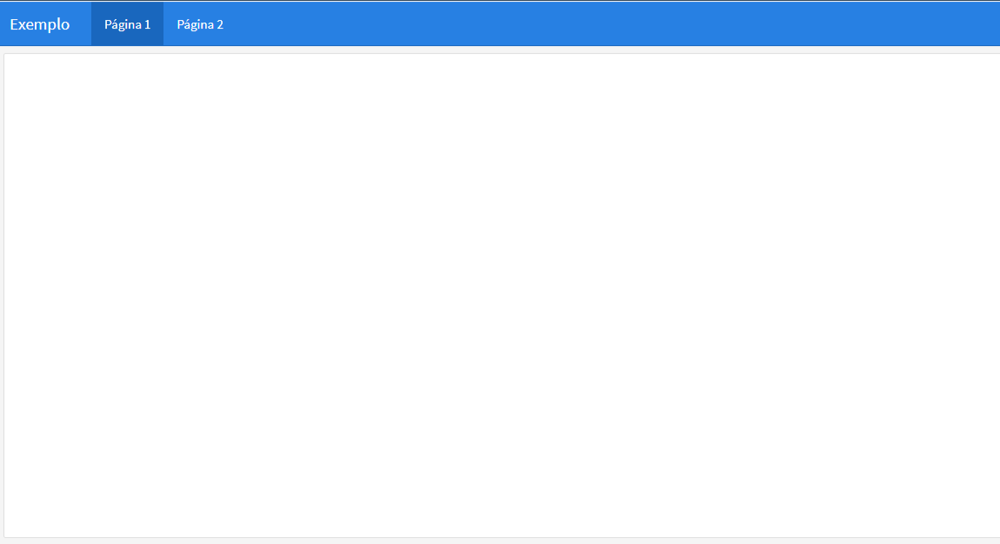{width="621"}

A orientação pode ser especifizada para cada página. O `{data-orientation=rows}` ou `{data-orientation=columns}` aplicado ao cabeçalho da página define o layout para todos os componentes dentro daquela página. No exemplo a seguir,a primeira página usa colunas, e a segunda usa linhas.

```{r orientacaopag,eval=F}

Página 1 {data-orientation=rows}
===
  
  
Página 2 {data-orientation=columns}
===


```

Dentro de cada página, os componentes são organizados usando `##` ou `Nome_Seção ---` para definir colunas (se a orientação da página for `columns`) ou linhas (se a orientação for `rows`). Cada gráfico ou componente individual é então definido com `###`.

```{r colunas e  componentes,eval=F}

Página 1 {data-orientation=rows}
===
  
Seção 1 
---
  
### Gráfico 1

### Gráfico 2

  
Seção 2
---
  
### Gráfico 3
  
  
  
  
# Página 2 {data-orientation=columns}
  
  
## Seção 3
  
### Gráfico 4
  
### Gráfico 5
  
  

## Seção 4

### Gráfico 6


```

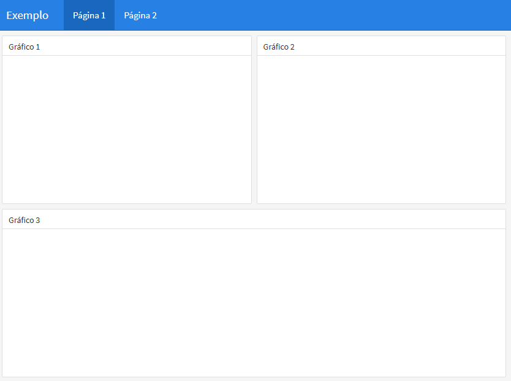{width="625"}

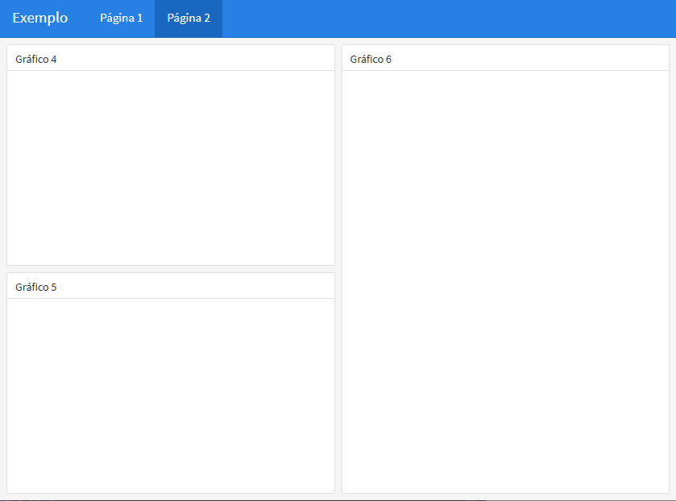{width="631"}

Alguns ajustes podem ser feitos para melhorar a apresentação do dashboard:

-   **Controle de Tamanho**: Você pode usar atributos como `{data-width = ...}` em um cabeçalho de coluna/linha (`##`ou `---`). É importante garantir que a largura das seções somem 1000.

-   **Navegação por Abas**: Se uma página tiver muitos componentes, é viávei organizá-los em abas usando o `{.tabset}` em um cabeçalho de linha ou coluna para manter o dashboard organizado.

```{r ,eval=F}
Página 1 
===
  
Seção 1 {data-width=300}
---
  

### Gráfico 1
  

### Gráfico 2


Seção 2{data-width=650}{.tabset}
---


### Gráfico 3
  
### Gráfico 4

### Gráfico 5


```

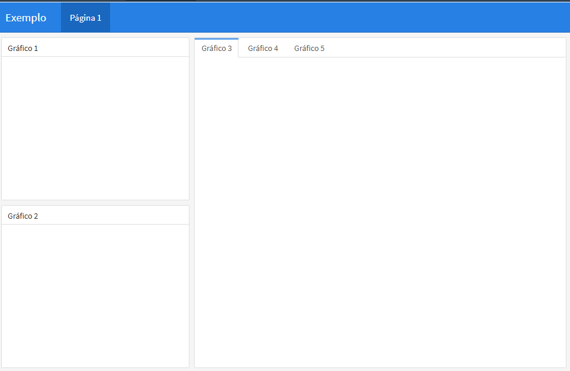{width="598"}

<br>

## **Inserção de Elementos no Dashboard**

Para inserir gráficos e tabelas no dashboard, é preciso colocar os códigos dentro de um chunk abaixo na "caixa" desejada.

Definir `fig.width` e `fig.height` é importante quando desejamos colocar gráficos estáticos, pois ele não se adapta automaticamente ao tamanho do painél.

````{r plot,eval=F}


Página 1 
===
  
Seção 1 
---
  

### Gráfico 1
  
```{r}
plot(mtcars$mpg, mtcars$hp)
```

````

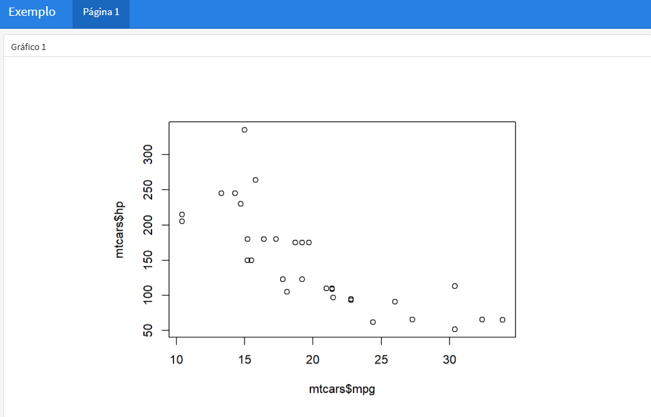{width="609"}

<br>

Para mostrar uma tabela simples num dashboard estático, utilizamos a função `kable()` do pacote `knitr`:

````{r kable,eval=F}

Página 1 
===
  
Seção 1 
---
  

### Gráfico 1

```{r}
plot(mtcars$mpg, mtcars$hp)
```

### Tabela 1

```{r}
knitr::kable(mtcars)
```

````

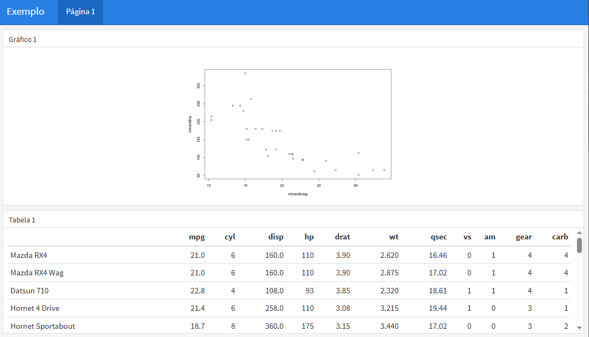{width="608"}

<br>

### Componentes Estáticos

Com o flexdashboard, é possível inserir alguns componentes como uma caixinha de valores ou um medidor.

Para criar a caixa, utilize a função `valueBox()` e como primeiro argumento insira a informação desejada. Para customizar, podemos utilizar os argumentos `icon=` para atribuir um ícone e `color` para mudar a cor da caixa.

````{r ,eval=F}
Row
-----------------------------------------------------------------------


### Comentários do Facebook

```{r}
valueBox(26, icon = "ion-social-facebook",
         color = "#1B1F61")
```


### Spam nos e-mails

```{r}
spam = 15
valueBox(spam, 
         icon = "ion-ios-trash",
         color = ifelse(spam > 10, "warning", "primary"))
```


### Medidor de Curtidas

```{r}
curtidas = 680
gauge(curtidas, min = 0, max = 1000, 
      sectors = gaugeSectors(success = c(750, 1000), 
                            warning = c(350, 750),
                            danger = c(0, 350)))
```

````

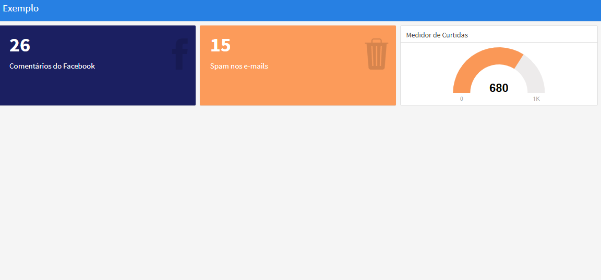{width="614"}

| Lista de ícones nos seguintes sites: <https://fontawesome.com/icons> e <https://ionic.io/ionicons>

<br>

## **Interatividade com o Shiny**

O Shiny é um sistema para desenvolvimento de aplicações web usando o R, um pacote do R (shiny) e um servidor web (shiny server).

Instale e rode a biblioteca:

```{r instalar shiny, eval = FALSE}
install.packages('shiny')
library(shiny)
```

Precisamos seguir os seguintes passos para usar a interatividade oferecida pelo Shiny:

-   Adicione `runtime: Shiny` do cabeçalho YAML, ele é obrigatório para interatividade;

-   Adicione `{.sidebar}` na coluna

-   Coloque os Inputs e Outputs.

### **Inputs**

São elementos que permitem ao usuário **interagir** com a aplicação: selecionar opções, inserir valores, clicar em botões, etc

Alguns exemplos de `*Input()`são :

| Função R | Tipo de Input | Descrição |
|--------------------|------------------------------|----------------------|
| `selectInput` | Caixa de seleção | Uma caixa com opções para selecionar |
| `sliderInput` | Barra deslizante | Uma barra para selecionar valores numéricos |
| `radioButtons` | Botões de rádio | Um conjunto de botões onde apenas um pode ser selecionado |
| `textInput` | Campo de texto | Um campo para inserir texto livre |
| `numericInput` | Campo numérico | Um campo para inserir números |
| `checkboxInput` | Caixa de verificação | Uma única caixa de verificação |
| `dateInput` | Calendário | Um calendário para seleção de data |
| `dateRangeInput` | Par de calendários | Dois calendários para selecionar um intervalo de datas |

Todas as funções Input possuem argumentos chamados `inputId` (código do input) e `label` (o texto que aparecerá), os demais argumentos variam de acordo com cada função.

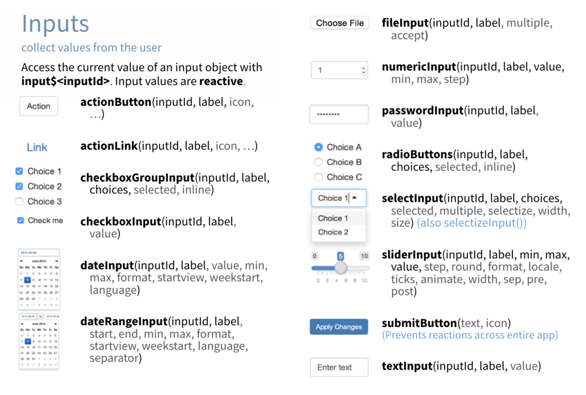

<br>

### **Outputs**

É visualização atualizada pela variável escolhida com Input.

**Tabela de Outputs do Shiny**

| Função R        | Tipo de Output       |
|-----------------|----------------------|
| `renderPlot`    | Gráficos R           |
| `renderPlotly`  | Gráficos Interativos |
| `renderPrint`   | Saída impressa       |
| `renderTable`   | Tabelas              |
| `renderText`    | Texto                |
| `renderLeaflet` | Mapas Interativos    |

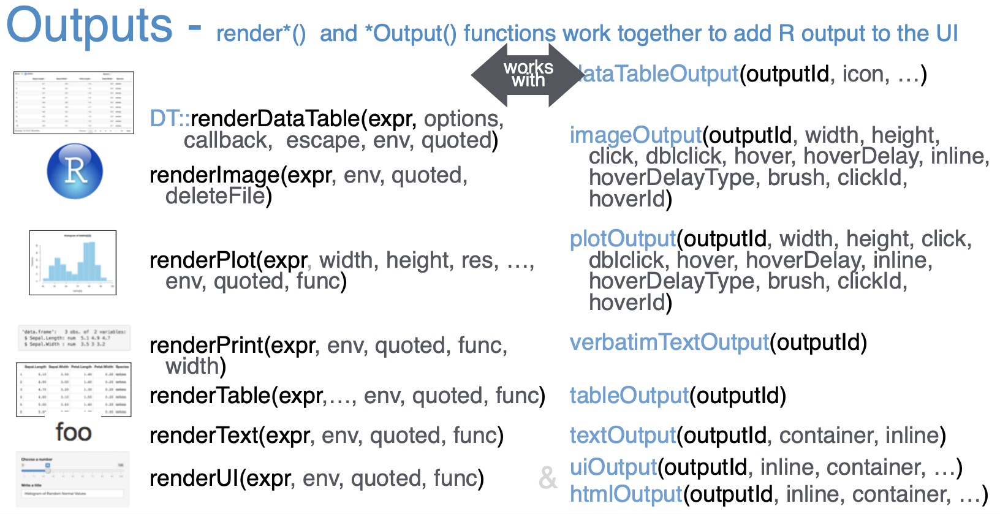

<br>

## **Temas para o Dashboard**

Uma das principais maneiras de mudar o estilo do dashboard é através do Bootswatch que são "temas prontos" para o esqueleto do Bootstrap. São conjuntos de cores, fontes e estilos pré-definidos.

Para mais simplicidade, podemos usar temas prontos do [Bootswatch](https://bootswatch.com):

```{r,eval=F}
---
title: "Exemplo"
output: 
  flexdashboard::flex_dashboard:
    theme: 
      version: 4
      bootswatch: pulse 
runtime: shiny
---

```

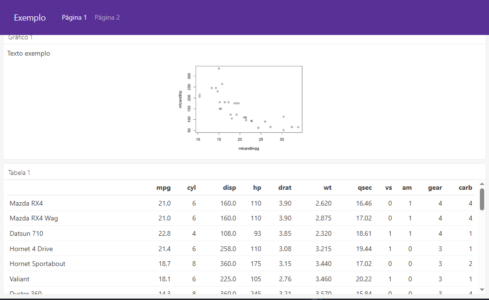{width="635"}

<br>

Ou especifizar os componentes no YAML:

```{r,eval=F}
---
title: "Exemplo"
output: 
  flexdashboard::flex_dashboard:
    theme: 
      version: 4
      bg: "#FDF7F7" 
      fg: "#101010"
      primary: "pink"
runtime: shiny
---

```

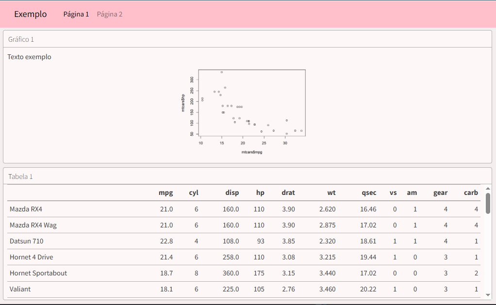{width="647"}
